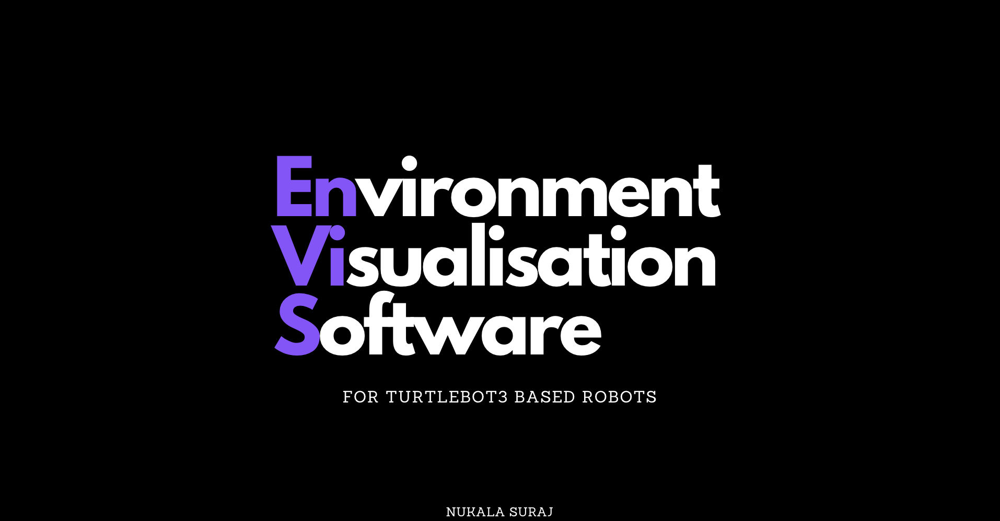

# envious (/envy us/)

The UI platform to help Control and Visualize Data from your TurtleBot (or any ros based robot)

# Links
1. [source code](https://github.com/lucidmach/envious)
2. [documentation](https://lucidmach.notion.site/Documentation-e2b6b57269374ffc91839d174ffeafc9)
3. [progress log](https://lucidmach.notion.site/Environment-Visualisation-Software-for-TurtleBot3-based-Robots-6062216d246843988fec1abf3205e6b4)
4. [support](https://www.buymeacoffee.com/lucidmach/)
5. [contact](https://lucidmach.tech/)
6. [presentation](https://www.canva.com/design/DAFYFxzxXho/K2Dayd5E3UdOAcrEu-671Q/view?utm_content=DAFYFxzxXho&utm_campaign=designshare&utm_medium=link2&utm_source=sharebutton)